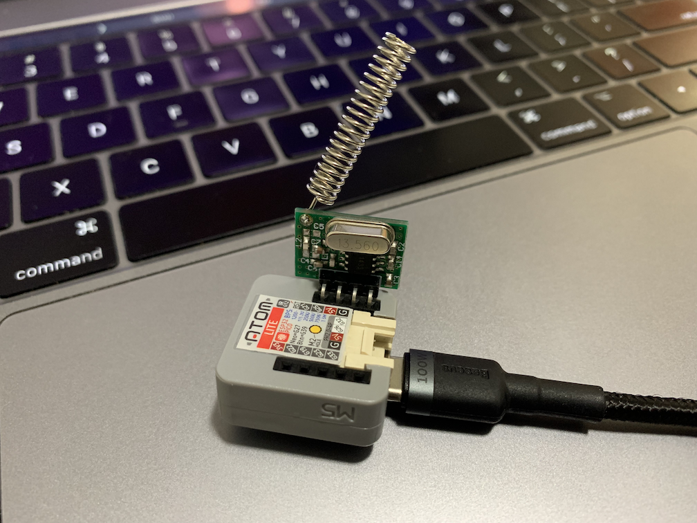

# Arno VX10 VX12 Controller

This library allows you to control your **Arno Fan** using a ESP32 or ESP8266 device.

# Supported Codes

- Lights
- Fan
- Increase Speed
- Decrease Speed
- Mode
- Sleep (Silent)
- Timer

# How to use it

Download the latest release and put it in your Arduino library folder. There are two examples that can be used to get started.

# Controlador Arno VX10 VX12

Esta biblioteca permite controlar o **Ventilador Arno** usando um dispositivo ESP32 ou ESP8266.

# Códigos Suportados

- Luzes
- Ventilador
- Aumentar Velocidade
- Diminuir Velocidade
- Modo Ventilador/Exaustor
- Dormir (Modo Siliencioso)
- Temporizador

# Como Usar

Faça o download da versão mais recente e coloque no diretório libraries dentro da pasta do seu Arduino.

# Testes

Este projeto foi testado usando um ESP32 (M5Stack ATOM Lite) com um transmissor RF 433.93. Para o teste eu usei 2 ventiladores um com o DIP Switch configurado em 0 (0000) e outro em 4 (0100), não foi testado outras combinações com o DIP Switch, portanto existe a possibilidade de não ter sido mapeado corretamente a configuração para identificar o ventilador desejado. Eu vou comprar mais um aparelho igual para outro cômodo da minha casa e quando chegar eu faço um teste para saber o se o DIP Switch está mapeado corretamente.

- ESP32 ATOM Lite -> [AliExpress](https://www.aliexpress.com/item/4000576823662.html)
- RF 433 MHz -> [AliExpress](https://www.aliexpress.com/item/32961818482.html)

# Agradecimento

Agradecimento ao [Samuel Kato](https://github.com/samuelkato/arno-vx10), que compartilhou seu trabalho fazendo a leitura dos códigos do controle usando um ociloscópio.
